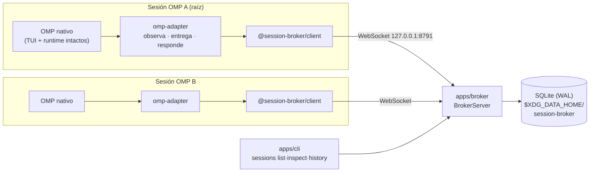
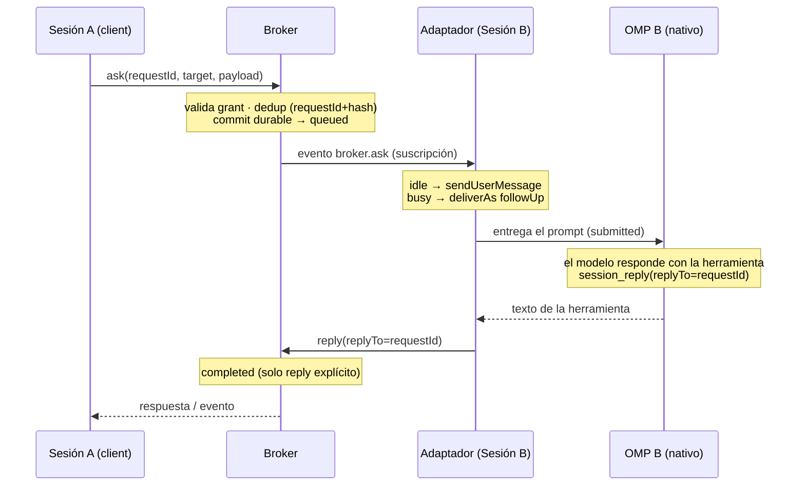
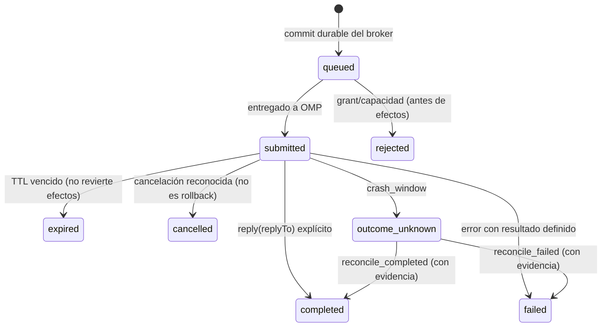

# session-broker

[](https://github.com/leobar37/session-broker/actions/workflows/verify.yml)

**Broker de sesiones standalone para coordinar agentes de código (OMP) entre sí — con autenticación real, persistencia durable y recovery honesto.**

- Versión de protocolo: `1.0.0` (congelada)
- Stack: Bun + TypeScript + SQLite (sin dependencias de runtime externas)
- Estado: **implementado y verificado** — `bun run verify` → exit 0 (291 tests, 6 suites)
- Consumo: local y offline vía tarballs; **no publicado en npm**

---

## Tabla de contenidos

1. [Por qué existe este repo](#por-qué-existe-este-repo)
2. [Para qué sirve](#para-qué-sirve)
3. [Cómo funciona: la idea en 30 segundos](#cómo-funciona-la-idea-en-30-segundos)
4. [Arquitectura](#arquitectura)
5. [Los cinco paquetes](#los-cinco-paquetes)
6. [El flujo ask/reply, paso a paso](#el-flujo-askreply-paso-a-paso)
7. [La máquina de estados de un request](#la-máquina-de-estados-de-un-request)
8. [Seguridad: tres capas](#seguridad-tres-capas)
9. [Durabilidad, dedup y recovery honesto](#durabilidad-dedup-y-recovery-honesto)
10. [Backpressure y límites](#backpressure-y-límites)
11. [Arranque rápido](#arranque-rápido)
12. [Caso de uso: integrar una sesión OMP](#caso-de-uso-integrar-una-sesión-omp)
13. [Pipeline CI](#pipeline-ci)
14. [Verificación reproducible](#verificación-reproducible)
15. [Consumo local sin npm](#consumo-local-sin-npm)
16. [¿Y publicar a npm?](#y-publicar-a-npm)
17. [Qué NO hace (gates)](#qué-no-hace-gates)
18. [Estructura del repo](#estructura-del-repo)
19. [Documentación completa](#documentación-completa)

---

## Por qué existe este repo

Cuando orquestás varias sesiones de un agente de código (OMP), aparece un
conjunto de problemas que nadie resuelve de verdad:

1. **Las sesiones están aisladas.** Una sesión no puede preguntarle a otra,
   esperar su respuesta y continuar. Los "puentes" típicos son frágiles:
   parsean la TUI, inyectan texto ciego o dependen de detalles internos.

2. **Los orquestadores mentirosos.** La mayoría de los sistemas de colas
   prometen *exactly-once* cuando en realidad nadie puede garantizarlo: si el
   proceso muere **entre** aplicar un efecto en el mundo y persistir el
   resultado, simplemente *no sabés qué pasó*. Inventar un reintento ahí
   ejecuta trabajo duplicado; inventar un éxito ejecuta trabajo perdido.

3. **El broker que se vuelve dios.** Si el coordinador termina ejecutando
   inferencia, tocando la TUI o relanzando sesiones, dejás de poder confiar en
   lo que ves: la presencia de un agente no dice nada sobre el estado real de
   su tarea, y cada capa que "ayuda" es una capa que oculta.

4. **Autenticación decorativa.** UUIDs como credenciales, tokens compartidos,
   secrets en el checkout: la identidad de "quién puede controlar esta sesión"
   suele ser una sugerencia, no un control.

Este repo nace para resolver **eso**: un broker genérico, standalone y
verificable donde:

- el broker **jamás ejecuta inferencia** ni sustituye la TUI nativa del agente;
- la **incertidumbre es un estado de primera clase** (`outcome_unknown`) que
  exige reconciliación explícita con evidencia, nunca un reintento a ciegas;
- la autenticación es real: **grants con `credentialHash` sha256**, fencing por
  `control_epoch` y un **root binding criptográfico** que impide que un
  subagente suplante a su sesión raíz;
- todo lo que se declara tiene **evidencia reproducible** detrás (source hash +
  suites aisladas + un consumidor externo que prueba los exports públicos sin
  publicar nada).

> La motivación original: permitir que un *orquestador maestro* consuma estos
> paquetes desde un checkout local **sin publicar en npm y sin dependencia
> inversa** con ningún monorepo privado. El consumidor compone todo desde
> exports públicos; nada de imports privados.

## Para qué sirve

Casos de uso concretos:

| Caso | Cómo lo resuelve el broker |
| --- | --- |
| **Delegar una pregunta de una sesión a otra** | `ask` encola un mensaje para la sesión objetivo; el adaptador lo entrega solo cuando la sesión está `idle` (o como follow-up si está ocupada) y la respuesta vuelve correlacionada por `replyTo=requestId`. |
| **Observar sesiones sin molestarlas** | Lecturas nativas (`observe`) con **contador de inferencia en 0**: ver el estado de una sesión no consume tokens ni altera su TUI. |
| **Saber qué sesión tiene autoridad** | `control_epoch` + leases: si otro proceso toma la sesión, el epoch viejo falla con `STALE_CONTROL_EPOCH`. Nada de instancias zombis. |
| **Sobrevivir crashes sin duplicar trabajo** | Dedup durable por `requestId + hash(payload)`: reintentar después de un crash es idempotente. La ventana de incertidumbre queda en `outcome_unknown` y se resuelve **solo** con evidencia real. |
| **Consumir el histórico con huecos honestos** | Suscripciones con cursores: si el consumidor es lento se corta con `QUEUE_FULL` (nunca descarte silencioso); si el cursor venció, `CURSOR_EXPIRED` y snapshot con `gap: true`. |
| **Operar sin miedo a perder autorización** | Backup con `VACUUM INTO` y restore **conservador**: la copia restaura datos, no confianza (ver [recovery](#durabilidad-dedup-y-recovery-honesto)). |

**Qué NO es:** no es un chatbot, no es un proxy de LLM, no es un runner de
tareas, no es un sistema exactly-once. Es la capa de *coordinación honesta*
entre sesiones.

## Cómo funciona: la idea en 30 segundos

```
┌─────────────────┐                          ┌─────────────────┐
│  Sesión OMP A   │                          │  Sesión OMP B   │
│ (TUI nativa ✅) │                          │ (TUI nativa ✅) │
│  ┌───────────┐  │                          │  ┌───────────┐  │
│  │omp-adapter│  │                          │  │omp-adapter│  │
│  └─────┬─────┘  │                          │  └─────▲─────┘  │
│        │ client │                          │        │ client │
└────────┼────────┘                          └────────┼────────┘
         │  WebSocket (protocolo 1.0.0)               │
         ▼                                            │
      ┌───────────────────────────────────────────────┴──┐
      │              BROKER (proceso único)              │
      │  grants · dedup durable · ask/reply correlacionado│
      │  cursores · control epoch · límites congelados    │
      │              ┌────────────────┐                   │
      │              │ SQLite (WAL)   │                   │
      │              └────────────────┘                   │
      └───────────────────────────────────────────────────┘
```

Cada sesión OMP corre un **adaptador** por dentro (la TUI sigue siendo 100%
nativa). El broker es un solo proceso con SQLite que enruta mensajes,
autentica, deduplica y persiste. Todo se habla por WebSocket con un protocolo
versionado y fail-closed.

## Arquitectura



Reglas de diseño congeladas:

- **Un solo escritor por store** (writer lock en SQLite): dos procesos sobre el
  mismo `dataDir` es un error explícito, no una carrera silenciosa.
- **Protocolo versionado y fail-closed**: handshake `hello`/`welcome` negocia la
  versión; si no hay match exacto, se rechaza (sin fuzzy fallback).
- **El broker no relanza sesiones**: si el objetivo está offline responde
  `TARGET_OFFLINE` y punto. La vida de las sesiones OMP no le pertenece.

## Los cinco paquetes

| Paquete | Qué exporta (resumen) | Rol |
| --- | --- | --- |
| `@session-broker/protocol` | `PROTOCOL_VERSION`, `OPERATIONS`, `REQUEST_STATES`, `LIMITS`, `CAPABILITIES`, validadores de envelopes, dedup, grants, root proof | Contratos congelados. La única fuente de verdad del "qué se puede decir". |
| `@session-broker/client` | `createClient`, `BrokerClientError`, reconexión con backoff | Cliente WebSocket outbound reusable, autenticado. |
| `@session-broker/server` (`apps/broker`) | `createBrokerServer`, `createBackup/verifyBackup/restoreBackup`, `createLogger` (con redacción de secretos) | El broker: routing, dedup durable, cursores, health, backup. |
| `@session-broker/cli` (`apps/cli`) | `runCli(argv) → exit code 0..17`, `renderSystemdUserUnit` | `sessions list/inspect/history`, init idempotente, unidad systemd **generada, no instalada**. |
| `@session-broker/omp-adapter` | `createOmpAdapter`, `issueRootProof` | El puente OMP↔broker: entrega when-idle, captura `session_reply`, notifica `runState`, **declara capacidades honestas** (lo no soportado falla *antes* de efectos). |

Fronteras duras: está **prohibido** importar `@session-broker/*/src/...` — solo
exports públicos. La suite del handoff lo verifica.

## El flujo ask/reply, paso a paso

La operación estrella: la sesión A le hace una pregunta a la sesión B y espera
la respuesta.



Regla clave: **ni `agent_end` ni el siguiente texto del modelo completan un
ask.** Solo la herramienta explícita `session_reply` con `replyTo = requestId`.
Sin esa correlación, "creo que respondió" no es una respuesta.

## La máquina de estados de un request

Estados congelados (`REQUEST_STATES` en protocol):



Y tres identidades que **nunca** se colapsan:

> **presencia ≠ request state ≠ job status**
>
> Que una sesión esté online no dice si está ocupada. Que un request esté
> `submitted` no dice si la tarea nativa terminó. El broker no inventa puentes
> entre esas dimensiones.

`outcome_unknown` merece su propia regla: significa **«no sé qué pasó»**, no
«reintentá». Reenviar falla con `outcome_unknown_no_replay`; solo la
reconciliación explícita (`reconcile_completed` / `reconcile_failed`) —con
evidencia real del runtime— lo resuelve.

## Seguridad: tres capas

1. **Grants con credencial hasheada.** El handshake autentica contra
   `grants.json` (permisos `600`) que guarda **solo** `credentialHash =
   sha256(credential)`. La credencial en claro jamás se persiste, jamás viaja
   en la línea de comandos y jamás aparece en logs (redacción por defecto).
   Grants con scope por acción; sin UUID-como-auth.

2. **Root binding (identidad no heredable).** La sesión raíz emite un proof
   MAC (`SESSION_BROKER_MAC_KEY`, desde archivo o EnvironmentFile `600`, nunca
   CLI). El broker verifica contra un ledger: **un subagente que hereda claims
   es denegado**. Los consumos de proofs quedan en el ledger y no se reviven
   tras un restore.

3. **Control fencing (`control_epoch`).** Controlar una sesión exige el epoch
   vigente. Takeover, crash o restore incrementan el epoch: cualquier control
   viejo falla con `STALE_CONTROL_EPOCH`. Lease TTL 24 h.

Rutas de datos (fuera del checkout, siempre):

| Artefacto | Ruta | Permisos |
| --- | --- | --- |
| Config del cliente (endpoint, grant, credential) | `$XDG_CONFIG_HOME/session-broker/config.json` | `600` |
| Data del broker (SQLite, journal, grants) | `$XDG_DATA_HOME/session-broker` | `700`/`600` |
| Journal de recibos del adaptador | `<dataDir>/omp-adapter-receipts/*.json` | `600` |

## Durabilidad, dedup y recovery honesto

**Dedup durable.** Cada request se persiste por `requestId + hash(payload)`.
Un reintento posterior a un crash es idempotente: o ya está (misma respuesta) o
es trabajo nuevo legítimo. Nunca duplicado silencioso.

**Backup.** Método soportado: `VACUUM INTO` (snapshot consistente que incluye
el WAL). Copiar a mano `broker.sqlite` + `-wal` de un proceso vivo **no** está
soportado y el tooling no lo hace. `verifyBackup` valida hashes,
`integrity_check` y correspondencia del journal en solo-lectura.

**Restore conservador — la copia restaura datos, no confianza:**

1. **Sin `grants.json`** en el directorio restaurado (fail-closed): el operador
   debe re-autorizar explícitamente (`requiresReauthorization`).
2. Leases invalidados: sesiones `offline`, sin titular.
3. `control_epoch + 1` por sesión: fencing de cualquier instancia vieja.
4. El writer lock **no viaja**: la copia adquiere el suyo propio.
5. Ledger de root proofs íntegro (los consumos no se "reviven").
6. `outcome_unknown` se conserva tal cual: dedup y recibos viajan para que un
   reintento antiguo sea idempotente, jamás trabajo nuevo.

## Backpressure y límites

Valores congelados (`packages/protocol/src/limits.ts`, documentados en
`docs/contracts/limits.md`):

| Límite | Valor | Al exceder |
| --- | --- | --- |
| `maxFrameBytes` / `maxPayloadBytes` | 1 MiB / 512 KiB | `frame_too_large` / `payload_too_large` |
| `maxQueuedAsksPerSession` | 8 | `QUEUE_FULL` |
| `maxInFlightRequestsPerGrant` | 32 | `QUEUE_FULL` |
| `maxRequestsPerMinutePerGrant` | 120 | `RATE_LIMITED` |
| Cola de eventos por suscripción | 1000 ítems / 4 MiB | corte **explícito** (`QUEUE_FULL`) |
| Retención request/event | 7 días | `CURSOR_EXPIRED` (CLI: exit 15) |
| `cursorTtlMs` | 1 h | snapshot explícito con `gap: true` |

Filosofía: un consumidor lento **nunca** agota la memoria del broker y **nunca**
pierde eventos en silencio: se le corta con un error nombrado y retoma desde
snapshot o cursor nuevo.

## Arranque rápido

```sh
# 1. Provisionar el data dir y arrancar el broker (primer plano):
SESSION_BROKER_DATA_DIR=~/.local/share/session-broker bun apps/broker/src/serve.ts
# → {"ready":true,"host":"127.0.0.1","port":8791}

# 2. Health (cuatro dimensiones, todas deben estar en verde):
curl -s http://127.0.0.1:8791/health | jq
# process.listening · store.usable/writer · schema.compatible · peers.*
#   ⚠ presencia ≠ request state ≠ job status

# 3. Desde otra terminal, la CLI:
bun apps/cli/src/cli.ts sessions list
```

Variables del entrypoint: `SESSION_BROKER_DATA_DIR` (obligatoria, absoluta),
`SESSION_BROKER_HOST` (default `127.0.0.1`), `SESSION_BROKER_PORT` (default
`8791`), `SESSION_BROKER_MAC_KEY` (opcional; solo vía archivo `--mac-key-file`
o EnvironmentFile `600`, **nunca** en la línea de comandos).

`SIGTERM`/`SIGINT` → shutdown ordenado: se cierran conexiones, timers y la DB;
**ningún request se completa artificialmente**.

Los logs son JSON por línea con redacción por defecto: `credential`, `macKey`,
`payload`, `question`, `result`, etc. se sustituyen por `[REDACTED]`.

## Caso de uso: integrar una sesión OMP

### ¿Hay un plugin instalable de OMP?

**Todavía no — y conviene ser preciso.** Lo verificado y entregado es:

- **`@session-broker/omp-adapter`**: la librería que vive *dentro* de una
  sesión OMP (entrega when-idle, captura de `session_reply`, notificación de
  `runState`, preservación de la TUI, journal de recibos).
- **`OmpExtensionHost`**: el **puerto estructural** tipado contra la API
  pública de OMP v18.3.1 — `on`, `registerTool`, `sendUserMessage`,
  `getSessionId`, `isIdle`, `subscribeRunState`, etc. (mapeos verificados en
  [`docs/compatibility/omp-api-matrix.md`](docs/compatibility/omp-api-matrix.md)).

Lo que **no existe aún** es el *shim*: la extensión instalable que implemente
ese puerto sobre un OMP vivo. Quedó declarado como integración futura en el
handoff (verificaría contra un OMP real y exigiría abrir el gate de
integración). Toda la evidencia corre contra `FakeOmpHost` + fake model.

### El wiring (qué implementaría el shim)

```ts
import { createOmpAdapter, type OmpExtensionHost } from "@session-broker/omp-adapter";

// 1. El shim futuro implementa el puerto con la ExtensionAPI real de OMP:
const host: OmpExtensionHost = {
  on: (event, handler) => extensionAPI.on(event, handler),              // lectura sin inferencia
  registerTool: (tool) => extensionAPI.registerTool(tool),              // registra session_reply
  sendUserMessage: (content, opts) => session.sendUserMessage(content, opts), // idle→turno · busy→followUp
  getSessionId: () => sessionManager.getSessionId(),
  isIdle: () => !session.isStreaming,
  subscribeRunState: (listener) => session.subscribeRunState(listener),
};

// 2. El adaptador compone cliente broker + puertos + root proof:
const adapter = createOmpAdapter({
  endpoint: "ws://127.0.0.1:8791",
  projectId, workspaceId, instanceId,
  nativeSessionId: host.getSessionId(),
  grantId, credential,             // credencial del config 600, jamás versionada
  host,
  macKey,                          // MAC key del config 600; jamás en CLI ni logs
  dataDir,                         // user data dir, fuera del checkout
  allowInsecureWs: true,           // política LOCAL explícita (solo loopback)
});
```

Eso es todo el contrato: el adaptador no toca la TUI, no ejecuta inferencia y
declara como `unsupported` lo que no tiene mapping verificado.

## Pipeline CI

GitHub Actions ejecuta el mismo `bun run verify` en cada push a `main` y PR
(`.github/workflows/verify.yml`): `bun install --frozen-lockfile` +
typecheck + 6 suites + barrido de teardown. Sin secretos, sin servicios, sin
inferencia real — el smoke del consumidor corre offline con tarballs locales.

## Verificación reproducible

```sh
bun install
bun run verify      # typecheck + 6 suites; exit 0 esperado
```

Qué verifica cada suite:

| Suite | Tests | Cubre |
| --- | --- | --- |
| `tests/protocol` | 83 | schemas, versión, IDs, estados, errores válidos/negativos |
| `tests/broker` | 46 | grants, persistencia, routing con SQLite temporal |
| `tests/cli` | 63 | init idempotente, exit codes, cliente mock |
| `tests/omp` | 25 | FakeOmpHost: root-binding, ask/reply, TUI no sustituida |
| `tests/recovery` | 46 | crash matrix, unknown sin replay, backup/restore, systemd fake |
| `tests/handoff` | 28 | consumidor externo, hash de fuente, coherencia del handoff |

Garantías del entorno de test: fake model que **falla si se le invoca** (cero
inferencia), red restringida a loopback, TMP/HOME/XDG efímeros con barrido
incluso en fallo.

El resultado queda sellado en **`docs/handoff/omp-broker-v1.json`** (+
proyección `.md` byte-a-byte): source hash determinista
(`sha256-canonical-file-manifest-v1`, algoritmo en
`tests/handoff/lib/source-hash.ts`), comandos observados con exit codes
reales, capacidades y limitaciones honestas. Si cambiás la fuente, el hash
deja de validar y `test:handoff` falla con `source-hash-mismatch` — así de
intencional.

## Consumo local sin npm

El repo no publica nada y aun así es consumible desde otro checkout:

```sh
# Desde este repo: empaquetar los cinco workspaces
for ws in packages/protocol packages/client packages/omp-adapter apps/broker apps/cli; do
  (cd "$ws" && bun pm pack)
done
# → tarballs *.tgz; referencialos con specs RELATIVAS file:../vendor/<nombre>.tgz
#   (y en `overrides` para las dependencias transitivas) + bun install --offline
```

`tests/handoff/consumer.test.ts` hace exactamente esto en un TMP externo —
incluida una **relocalización** a un segundo directorio — y afirma que el
consumidor solo usa exports públicos, sin rutas absolutas de la máquina, sin
red y sin secretos.

## ¿Y publicar a npm?

Este repo **no publica a npm por diseño** (el consumo local con tarballs es el
camino verificado; sin dependencia de ningún registry). Publicar sería un
**opt-in futuro del operador** — hoy no hay workflow de publish ni token
configurado, a propósito.

Si decidís abrir ese camino, el setup sería:

1. **Token**: crear un *granular access token* con scope mínimo y expiración
   corta en <https://docs.npmjs.com/creating-and-viewing-access-tokens>
   (referencia general: <https://docs.npmjs.com/about-access-tokens>).
2. **Secret de CI**: guardarlo como `NPM_TOKEN` en
   *Settings → Secrets and variables → Actions*
   (<https://docs.github.com/en/actions/security-guides/encrypted-secrets>).
   El token **jamás** se versiona ni aparece en logs.
3. **Publish**: `bun pm pack` por workspace + `npm publish` autenticado con
   `NPM_TOKEN` — en un workflow separado, **manual** (`workflow_dispatch`),
   nunca en el pipeline de verify.

Mientras ese gate siga cerrado, el consumo local de
[arriba](#consumo-local-sin-npm) es el camino soportado.

## Qué NO hace (gates)

Dos capacidades quedan **explícitamente fuera** del alcance verificado y
requieren opt-in humano:

| Gate | Qué bloquearía | Estado |
| --- | --- | --- |
| `G-BROKER-LIVE` | inferencia/proveedores reales, gasto | 🔒 cerrado — todas las suites usan fake model |
| `G-BROKER-SERVICE` | instalar/enable/start del servicio systemd user | 🔒 cerrado — solo artefactos de ejemplo en `ops/systemd/` |

También declarado con la misma honestidad:

- El binding root y la entrega when-idle están verificados contra **puertos
  estructurales** de la API OMP (FakeOmpHost + fake model); un shim de
  producción sobre OMP vivo es integración futura.
- `session.control.*` (steer/abort/follow_up/prompt) es `unsupported`
  explícito: falla con `UNSUPPORTED_CAPABILITY` **antes** de cualquier efecto.
- No hay exactly-once externo: ver [`outcome_unknown`](#la-máquina-de-estados-de-un-request).

## Estructura del repo

```
├── apps/
│   ├── broker/src/        # servidor: server.ts, store.ts, backup.ts, serve.ts
│   └── cli/src/           # runCli, systemd.ts (generador de unidad user)
├── packages/
│   ├── protocol/src/      # contratos congelados: operations, states, limits, errors, grants…
│   ├── client/src/        # cliente WebSocket con reconexión
│   └── omp-adapter/src/   # adaptador nativo OMP + root proof
├── tests/
│   ├── protocol|broker|cli|omp|recovery/   # una suite por frontera
│   └── handoff/           # build-handoff.ts, source-hash.ts, consumer.test.ts…
├── docs/
│   ├── contracts/         # límites, paquetes, freeze de capacidades
│   ├── compatibility/     # matriz OMP (§A1..§A8)
│   ├── operations/        # guía de operación (backup, logs, troubleshooting)
│   ├── handoff/           # evidencia verificada (generada, no editar a mano)
│   └── artifacts/         # visual explainer (arquitectura, flujos)
├── ops/systemd/           # plantillas de ejemplo (NO instaladas)
└── scripts/verify.ts      # agrega typecheck + suites + teardown
```

## Documentación completa

- [`docs/operations/README.md`](docs/operations/README.md) — operación real: health, logs, backup/restore, troubleshooting, systemd (condicionado a gate)
- [`docs/handoff/omp-broker-v1.md`](docs/handoff/omp-broker-v1.md) — handoff verificado: evidencia, capacidades, límites, trazabilidad FR/NFR
- [`docs/contracts/`](docs/contracts/) — límites congelados, exports públicos, freeze de capacidades
- [`docs/compatibility/omp-api-matrix.md`](docs/compatibility/omp-api-matrix.md) — matriz de compatibilidad OMP v18.3.1
- [`docs/artifacts/broker-arquitectura/`](docs/artifacts/broker-arquitectura/index.html) — visual explainer (6 diagramas)

---

<sub>Protocolo `1.0.0` · OMP v18.3.1 · Bun ≥ 1.4 · SQLite · Sin publicación npm · Evidencia: `docs/handoff/`</sub>
